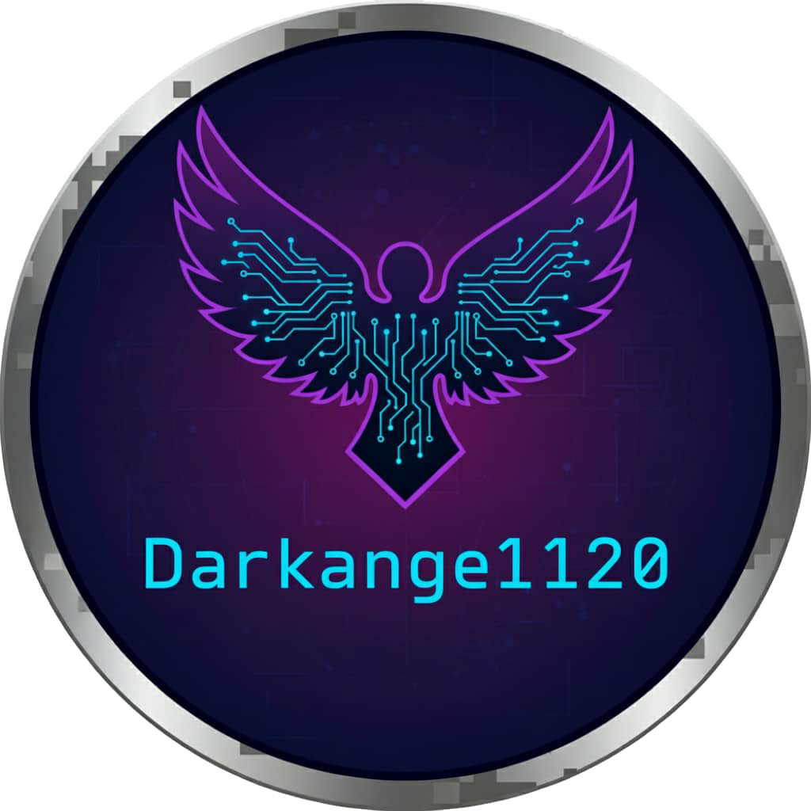

#  Mi Portafolio - Darkangel120

¡Hola! 👋 Bienvenido a mi portafolio personal. Soy Darkangel120, un desarrollador apasionado que comparte su trabajo en este sitio web moderno y responsive. Aquí muestro mis proyectos, habilidades y experiencia profesional.

## ✨ Lo que encontrarás aquí

Mi portafolio incluye secciones cuidadosamente diseñadas para mostrar mi trabajo:

- **Hero:** Una presentación atractiva con animación de escritura que destaca mi nombre y rol
- **Sobre Mí:** Cards animados que cuentan mi historia y pasiones
- **Habilidades:** Barras de progreso que muestran mi nivel en diferentes tecnologías, organizadas por categorías
- **Proyectos:** Una galería de mis trabajos más destacados con sliders y modales interactivos
- **Testimonios:** Reseñas de personas con las que he trabajado, con slider para navegación
- **Experiencia:** Una línea de tiempo de mi trayectoria profesional como desarrollador independiente
- **Contacto:** Formas de comunicarte conmigo
- **Reproductor de Música:** Un reproductor integrado con lista de reproducción personalizada para ambientar la visita

## 🚀 Tecnologías que uso

Trabajo principalmente con:
- **HTML5** para estructuras semánticas y accesibles
- **CSS3** para diseños responsive con animaciones y efectos visuales
- **JavaScript** para la interactividad y carga dinámica de contenido
- **JSON** para manejar datos multidioma

## 🎨 Diseño y Estilo

He creado un diseño moderno con:
- Tema oscuro con gradientes púrpura y azul
- Animaciones suaves en CSS
- Navegación intuitiva con menú hamburguesa
- Soporte completo para móviles, tablets y desktop
- Modales interactivos para ver detalles de proyectos con zoom en imágenes
- Sliders para navegación en proyectos y testimonios
- Carga esquelética para una experiencia de usuario fluida
- Soporte para múltiples idiomas (Español e Inglés)

## 📞 Contacto

Si quieres saber más sobre mí o mis proyectos, puedes contactarme:

- 📧 **Email:** dark_angel_12011@hotmail.com
- 🐙 **GitHub:** [Darkangel120](https://github.com/Darkangel120)
- 💼 **LinkedIn:** [Oswaldo Gómez](https://www.linkedin.com/in/oswaldo-gómez-5b6570383)

## 📄 Licencia

Este proyecto está bajo la Licencia MIT.

---

¡Gracias por visitar mi portafolio! Espero que te guste lo que ves :D .
